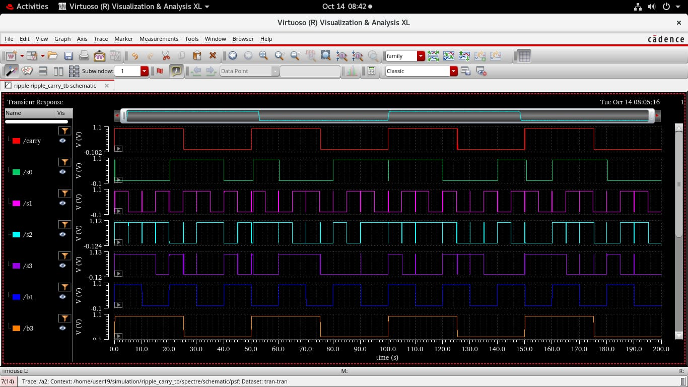
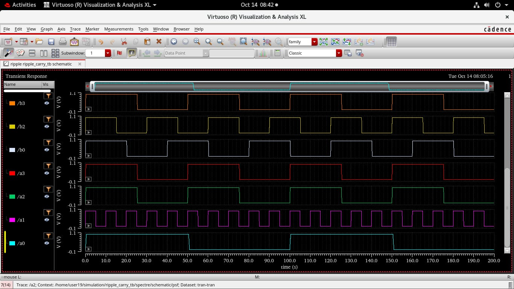

# 4-Bit Ripple Carry Adder using CMOS Transistor-Level Design in Cadence Virtuoso

This project demonstrates the **transistor-level implementation** of a 4-bit Ripple Carry Adder (RCA) using **CMOS logic** in Cadence Virtuoso with the 90 nm GPDK technology. The design is simulated using Spectre for transient analysis and verified for functional correctness.

---

## 🔧 Tools Used
- **Cadence Virtuoso** – Schematic design and simulation  
- **GPDK 90nm** – Process Design Kit  
- **Spectre Simulator** – For transient analysis  

---

## 📁 Project Structure

| Folder | Description |
|--------|--------------|
| `schematics/` | CMOS schematics of and, schematics of xor, full adder and RCA |
| `symbols/` | CMOS symbols of full adder and RCAs |
| `testbench/` | CMOS testbench of full adder and RCAs |
| `output/` | Transient waveforms and timing results |

---

## ⚙️ Design Flow
1. Designed basic CMOS gates (XOR, AND, OR).
2. Built a **Full Adder** using CMOS logic at transistor level.
3. Cascaded four Full Adders to form a **4-bit Ripple Carry Adder**.
4. Performed **Transient Analysis** using Spectre.
5. Verified output propagation and correctness.

---

## 📈 Simulation Results

**Transient Waveform:**  
  

---

## ⚙️ Design Flow

1. **Specification & Logic Design**
   - Defined the functionality of a 4-bit Ripple Carry Adder using four cascaded full adders.
   - Derived Boolean expressions for Sum and Carry outputs.

2. **Transistor-Level Schematic Design**
   - Designed basic CMOS logic gates (XOR, AND, OR) using GPDK 90nm technology.
   - Built a Full Adder cell at the transistor level using these gates.
   - Created a hierarchical schematic connecting four Full Adders to form the RCA.

3. **Simulation**
   - Configured testbench with input vectors for all combinations.
   - Performed **Transient Analysis** in Spectre to verify correct logical operation and timing.

4. **Layout Design**
   - Created layout for the RCA using Virtuoso Layout Editor.
   - Performed **DRC** (Design Rule Check) and **LVS** (Layout vs Schematic) verification.

5. **Result Verification**
   - Observed correct propagation of carry and valid Sum/Cout outputs.
   - Captured transient waveforms (`waveform_1.jpg`, `waveform_2.jpg`) confirming the expected performance.

---

**Example output**
| Inputs (A3–A0, B3–B0, Cin) | Outputs (S3–S0, Cout) |
|-----------------------------|------------------------|
| 1010 + 0101 + 0 | 1111, 0 |
| 1111 + 0001 + 0 | 0000, 1 |

---

## 🧠 Key Learnings
- CMOS transistor-level logic design  
- Full Adder implementation at device level  
- Delay and carry propagation study  
- Hierarchical schematic design in Cadence  

---
